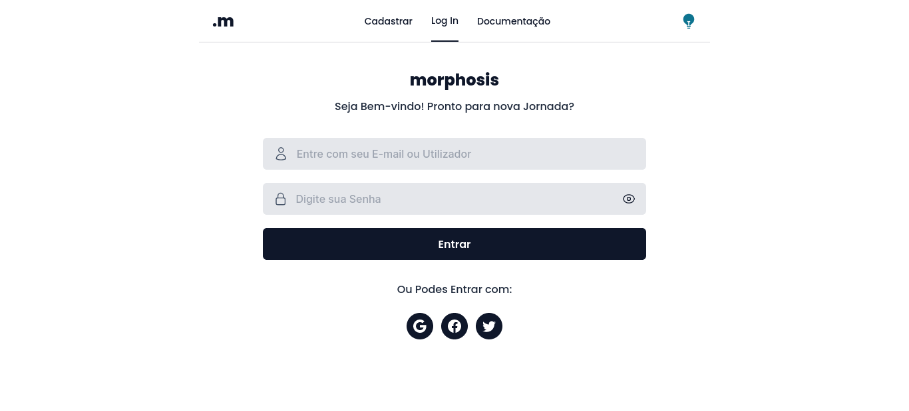

# Overview

Um formulário multi-step é uma maneira eficaz de coletar informações em várias etapas, tornando o processo de entrada de dados mais intuitivo e organizado. Neste projeto, estamos utilizando o Vue.js, uma estrutura JavaScript progressiva, e o Tailwind CSS, um framework de estilos utilitários, para criar um formulário multi-step atraente e funcional.

# Tecnologias

--- Vite.JS
--- Vue.js
--- TailwindCSS

# Imagens

# LINKS

Vercel URL Live:

